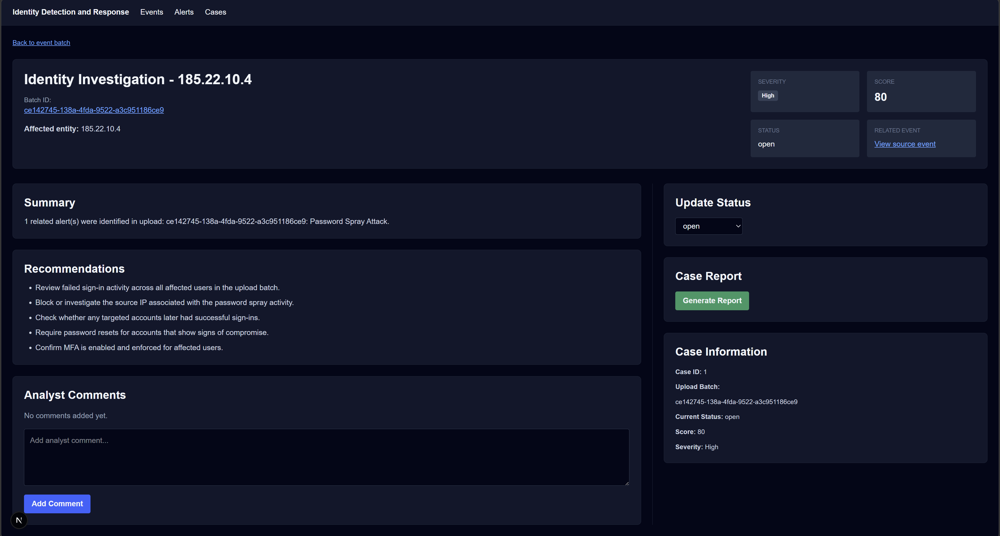
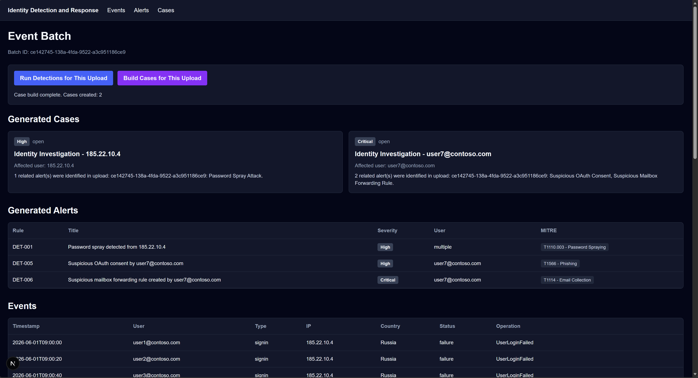
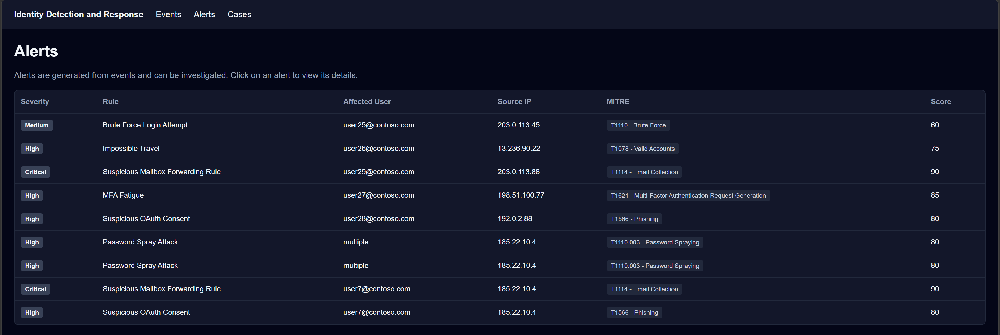

# Cloud Identity Attack Detection & Response Platform


## Overview

Cloud Identity Detection & Response Platform is a full-stack cyber security project that detects identity-based attacks from Microsoft Entra ID / Microsoft 365-style logs.

The platform ingests CSV logs, normalises authentication and audit events, runs detection logic, maps alerts to MITRE ATT&CK, groups alerts into analyst cases, and generates Markdown incident reports.

## Why This Project Exists

Identity attacks are a common route into organisations. This project demonstrates practical skills in log analysis, detection engineering, cloud identity security, SOC investigation, and incident response reporting.

## Investigation Workflow

1. Open the Events page.
2. Use the upload controls beside the Events heading to upload a CSV log file.
3. The system creates a unique upload batch UUID.
4. The uploaded CSV appears as an event batch card.
5. Open the batch to view parsed events.
6. Run detections against that batch.
7. Build cases from the generated alerts.
8. Open a case to review the summary, recommendations, status, comments, and report.
9. Add analyst comments, update case status, and generate a Markdown incident report.

## Upload Batch Linking

Each uploaded CSV creates an `upload_batch_uuid`.

This UUID links:

- uploaded file metadata
- parsed events
- generated alerts
- analyst cases
- case comments
- reports

This keeps separate investigations isolated from each other and avoids mixing events from multiple uploads.

## Detections

Each detection runs over a batch of normalised events and emits scored, MITRE-mapped alerts.

| Detection | Rule | MITRE | Trigger logic |
|---|---|---|---|
| Password spraying | DET-001 | T1110.003 | One source IP with 20+ failed sign-ins across 10+ distinct users |
| Brute force | DET-002 | T1110 | One source IP with 10+ failed sign-ins against a single user |
| Impossible travel | DET-003 | T1078 | Same user with successful sign-ins from two countries under 2 hours apart |
| MFA fatigue | DET-004 | T1621 | 5+ MFA denials for a user followed by a successful MFA approval |
| Suspicious OAuth consent | DET-005 | T1566 | Consent granted to an app requesting Mail.Read, Files.Read.All or offline_access |
| Suspicious mailbox forwarding | DET-006 | T1114 | New-InboxRule creating an external forward |

## Tech Stack
- Backend: Python, FastAPI, SQLAlchemy, Pandas
- Database: PostgreSQL
- Frontend: Next.js, TypeScript, Tailwind CSS
- DevOps: Docker Compose
- Testing: Pytest

## Screenshots

Case investigation view: grouped alerts, MITRE ATT&CK mapping, severity scoring and recommended response actions. Data shown is synthetic (Microsoft `contoso.com` demo dataset).



End-to-end pipeline: raw sign-in events ingested, detections run, alerts raised and cases built from a single upload batch.



Alerts view: Detections across brute force, impossible travel, MFA fatigue, OAuth consent, mailbox forwarding and password spray, each mapped to a MITRE technique and scored.



## Running Locally

```bash
docker compose up --build
```

## Features

- CSV log upload
- Event normalisation
- Password spray detection
- Brute force detection
- Impossible travel detection
- MFA fatigue detection
- Suspicious OAuth consent detection
- Suspicious mailbox forwarding detection
- MITRE ATT&CK mapping
- Alert severity scoring
- Analyst case generation
- Markdown report generation
- Frontend dashboard
- Docker Compose deployment
- Pytest detection tests

## Example scenario
A password spray attack results in one successful login, followed by suspicious mailbox forwarding. The platform links the events into one investigation case and recommends containment actions.

## Limitations
Synthetic dataset. No live Microsoft tenant integration by default. Response actions are recommendations only.

## License
This project is licensed under the MIT Licence. See the `LICENSE` file for details.
